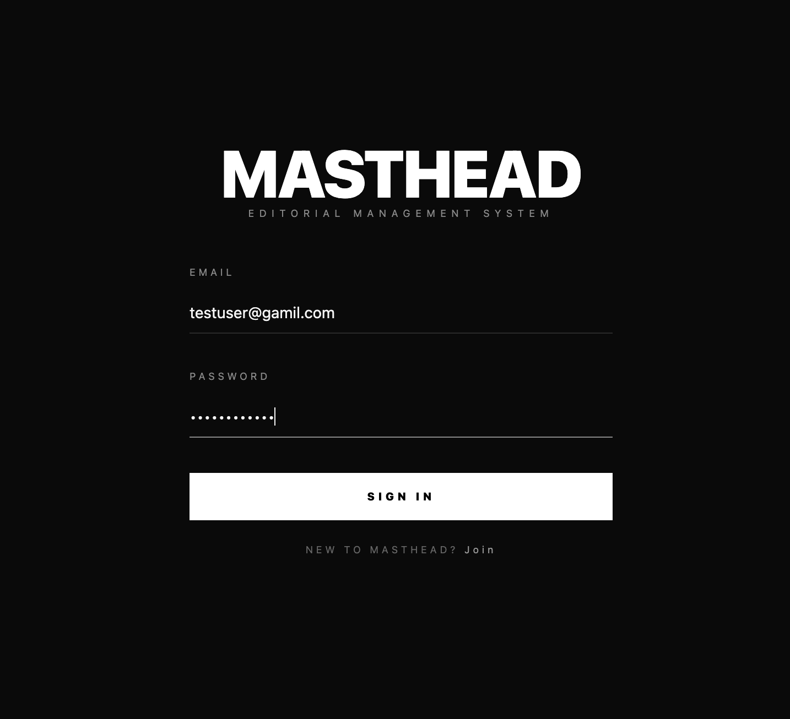
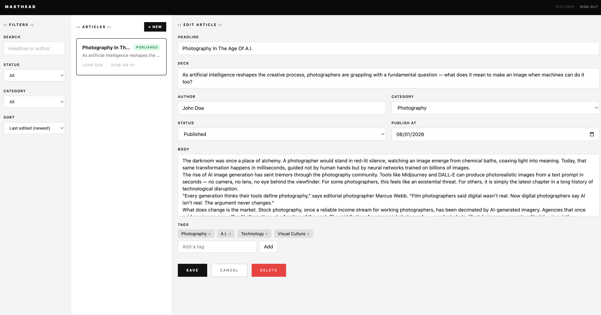

# Masthead

Masthead is a full-stack MERN editorial content management system for writers and editors to create, manage, and publish articles. Users can organize their work by status, filter and sort their article list, and edit content in a clean two-panel interface.

**Live Demo:** https://editorial-cms-mu.vercel.app
⚠️ The backend is hosted on Render's free tier and may take 30–60 seconds to wake up after a period of inactivity. Please allow a moment for the server to respond on first load.

## Screenshots

| Login                                 | Dashboard w/ Editor                                           |
| ------------------------------------- | ------------------------------------------------------------- |
|  |  |

## About

I built this application to demonstrate my ability to design, build, and deploy a complete full-stack MERN application. The project covers the full stack — from JWT-protected API routes and password hashing on the backend, to a Context API-driven React frontend with a persistent editing interface, deployed across two separate cloud platforms.

## Tech Stack

**Backend**

- Node.js – JavaScript runtime used to run the Express server
- Express.js – Handles API routing, middleware, and business logic
- dotenv – Manages environment variables and application secrets
- CORS – Enables secure communication between the frontend and backend on different origins

**Database**

- MongoDB Atlas – Cloud-hosted database that stores user accounts and article data
- Mongoose – Provides schema modeling and query interface for MongoDB

**Authentication & Security**

- JSON Web Token (JWT) – Implements stateless authentication for protected article routes
- bcryptjs – Hashes user passwords before they are stored in the database

**Frontend**

- React – Builds the component-based UI and manages application state
- Vite – Frontend build tool and development server
- Tailwind CSS – Utility-first CSS framework used for all styling
- Context API – Manages global article and auth state without external libraries

**Deployment**

- Render – Cloud platform used to deploy the Express backend API
- Vercel – Cloud platform used to deploy the React frontend

## Architecture Decisions

**Auth: localStorage vs HTTP-only cookies**

HTTP-only cookies were the original design choice and remain the more secure option — a cookie marked `HttpOnly` is never accessible to JavaScript, which eliminates token theft via XSS. However, cross-origin browser restrictions blocked cookie transmission between the Vercel frontend and the Render backend, which run on different root domains. Browsers require `SameSite=None; Secure` for cross-site cookies, and correctly configuring this alongside CORS on Render's free tier proved unreliable in practice.

JWT is stored in `localStorage` and sent as a `Bearer` token in the `Authorization` header. This works consistently across any two origins without cookie configuration complexity. With a custom domain that shares a root domain across frontend and backend (e.g. `masthead.app` and `api.masthead.app`), HTTP-only cookies would be the correct and preferred approach.

## Features

- Secure user registration and login with JWT authentication
- Protected routes — unauthenticated users are redirected to login
- Create, edit, and delete articles from a two-panel dashboard
- Edit headline, category, status, publish date, body, and tags
- Tags system with duplicate prevention (case-insensitive)
- Filter articles by search text, category, and publication status
- Sort by last updated, publish date, or headline (A–Z)
- Dark-themed login and register pages with a clean white dashboard

## Getting Started

**Prerequisites**

- Node.js v18+
- MongoDB Atlas account (free tier)

**Clone the repo**

```
git clone https://github.com/jamesvk/editorial-cms.git
```

**Backend setup**

```
cd server
npm install
```

Create a `.env` file in `server/`:

```
PORT=5000
MONGO_URI=your_mongodb_atlas_connection_string
JWT_SECRET=your_jwt_secret
NODE_ENV=development
CLIENT_URL=http://localhost:5173
```

```
npm run dev
```

**Frontend setup**

```
cd client
npm install
```

Create a `.env` file in `client/`:

```
VITE_API_URL=http://localhost:5000
```

```
npm run dev
```

## Future Improvements

- Password reset via email
- Email verification on registration
- Article cover image upload
- Rich text / Markdown editor
- Multi-user roles (admin, editor, author)

## Author

James Kim — [GitHub](https://github.com/jamesvk)
